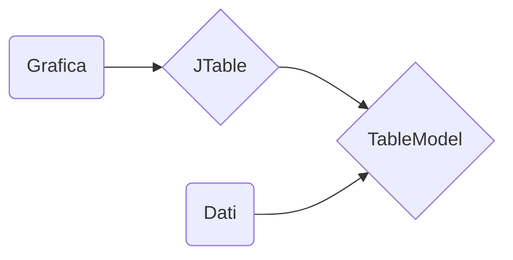
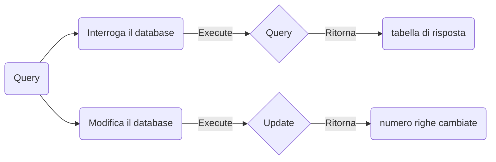

# Appunti di jdbc per la verifica

Gli appunti contengono:

- La classe `java.util.Vector`.
    > Come implementarla e utilizzarla al posto delle matrici

- Creare graficamente una tabella con il `JFrame` partendo da una mole di dati.
    > Come organizzare i dati e fare in modo che vengano formattati correttamente
    
- Interagire con i database
    > Collegarsi al database, esecuzione di query e utilizzo dei risultati

## Vector
L'unico requisito per fare tutte le operazioni che andremo a fare è imparare ad usare i Vector. Potrei dire che è esattamente uguale agli `array()` in php ma sto facendo una guida stupida che parte dal presupposto che chi sta leggendo sia un utonto :|

```java
Vector<Object> vector = new Vector();
```
Dentro le `<>` ci va il tipo di dato che andrà contenuto dentro il nostro array. Se si dichiara con `<String>` l'array potrà contenere solo tipi `class java.lang.String`. Andando a mettere il tipo `class java.lang.Object` l'array potrà contenere qualsiasi tipo di classe al suo interno (anche più classi diverse).
```java
Vector<Vector<Object>> vector = new Vector();
```
Andando a dichiarare il vettore in questo modo il nostro `vector` potrà contenere solo vettori. I vettori contenuti a loro volta potranno contenere qualsiasi tipo di dato.

**In questo modo possiamo simulare le matrici con vettori di vettori:**

*Matrice*:
||Colonna 1|Colonna 2|
|:-:|:-:|:-:|
|**Riga 1**|`10`|`Pino` |
|**Riga 2**|`20`|`Rino`|
|**Riga 3**|`30`|`Gino`|
*Vettore di Vettori*:
||Elemento 1|Elemento 2|
|:-:|:-:|:-:|
|**Vector 1**|`10`|`Pino` |
|**Vector 2**|`20`|`Rino`|
|**Vector 3**|`30`|`Gino`|

Nel secondo caso semplicemente ogni vettore avrà lo stesso numero di elementi. In questo modo si potrà trattare come una matrice:
```java
System.out.println (vector.get(2).get(0));
> 30
```

### Ma perchè utilizziamo i `Vector` al posto delle matrici?
I `Vector` sono dinamici e non abbiamo bisogno di sapere quanti elementi avranno quando lo istanziamo. Il vantaggio è il poter continuare ad aggiungere elementi finchè ne abbiamo senza preoccuparci. Sono più **comodi** e più semplici da leggere!

## Creare una Tabella

Abbiamo bisogno di un modello personalizzato al quale passiamo i nostri dati. Il modello fa da tramite tra quello che vuole sapere la tabella e i dati che vogliamo passare noi: infatti quello che facciamo è modificare i return delle funzioni predefinite del modello in modo da passare correttamente i dati.



### Creare il Modello
Per farlo andiamo a creare la nostra classe che implementa il TableModel:
```java
import javax.swing.event.TableModelListener;
import javax.swing.table.TableModel;
import java.util.Vector;

public class Model implements TableModel {
    private Vector<String> header; // vettore con tutti i nomi delle colonne
    private Vector<Vector<Object>> data; // matrice con tutti i dati (LA PRIMA RIGA NON È HEADER! sono solo dati)

    public Model (Vector<String> header, Vector<Vector<Object>> data) {
        this.header = header;
        this.data = data;
    }

    // Guardate ogni funzione e dovete capire perchè funziona!
    // Se non lo capite fate 2 rampe di scale e tornate in quarta (oppure chiedete a qualcuno)

    @Override
    public int getRowCount () {
        return this.data.size ();
    }

    @Override
    public int getColumnCount () {
        return this.header.size ();
    }

    @Override
    public String getColumnName (int columnIndex) {
        return this.header.get (columnIndex);
    }

    @Override
    public Class<?> getColumnClass (int columnIndex) {
        return this.data.get (0).get (columnIndex).getClass ();
    }

    @Override
    public boolean isCellEditable (int rowIndex, int columnIndex) {
        return false;
    }

    @Override
    public Object getValueAt (int rowIndex, int columnIndex) {
        return this.data.get (rowIndex).get (columnIndex);
    }

    @Override
    public void setValueAt (Object aValue, int rowIndex, int columnIndex) {}

    @Override
    public void addTableModelListener (TableModelListener l) {}

    @Override
    public void removeTableModelListener (TableModelListener l) {}
}
```

### Implementare la Grafica

Per implementare la grafica è molto semplice:

```java
public static void showTable (Vector<String> header, Vector<Vector<Object>> data) {
    JFrame frame = new JFrame ("Table");
    frame.setBounds (50, 50, 400, 400);
    frame.setDefaultCloseOperation (JFrame.DISPOSE_ON_CLOSE);
    frame.setLayout (null);

    // dare al costruttore della tabella il nostro modello personalizzato
    JTable table = new JTable (new Model (header, data));
    table.setBounds (0, 0, 300, 300);

    // dare allo ScrollPane la nostra tabella
    JScrollPane scrollPane = new JScrollPane (table);
    scrollPane.setBounds (0, 0, 300, 300); // si è stupido, gli devi ridare le coordinate
    
    // aggiungere solo lo scrollPane (e non la tabella) alla finstra
    frame.add (scrollPane);
    frame.setVisible (true);
}
```

## Interagire con il Database

### Stabilire una connessione con il database
> si ipotizza che abbiate già `XAMPP`, abbiate un vosto database che nel mio caso è `lezionishine` e che abbiate installato la libreria esterna `mysql-connector`

```java
// cambiate il nome del database (la porta di default di XAMPP è la 3306)
String url = "jdbc:mysql://127.0.0.1:3306/lezionishine";  
// qui stabilite la connessione e dovete dare nome utente e password
Connection connection = DriverManager.getConnection (url, "root", ""); 
// lo statement lo utilizzerete da ora in poi per eseguire le query 
Statement statement = connection.createStatement ();
```

### Eseguiamo le query

**Pro Tip**:
Utilizzate la formattazione con i `"""` per poter editare la query in modo più semplice!
```java
String query = """  
    INSERT INTO Lezioni (data, corso, durata) VALUES
    ("2022-05-15", "SP", 1.0);
    """;
 ```
 Ci sono 2 tipi di query:

Query che interroga il database:
```java
String query = """  
  SELECT data, corso, durata  
  FROM Lezioni;  
 """;  

// resultSet = la risposta del database (poi vediamo come andare a leggerlo)
ResultSet resultSet = statement.executeQuery (query);
```

Query che modifica il database:
```java
String query = """  
    DELETE FROM Lezioni  
    WHERE corso = "SP";
    """;
    
// result = numero di righe cambiate dalla query
int result = statement.executeUpdate (query);
```
### Leggere i resultSet
> Il nostro obbiettivo è dal `resultSet` riuscire ad estrapolare i nostri 2 vettori che ci servono: `header` e `data` (riguardare la creazione del nostro modello).
```java
// sapere il numero di colonne della tabella di risposta
int nCol = resultSet.getMetaData ().getColumnCount ();  

/*
* quando si va a lavorare con i resulSet dobbiamo ricordarci che
* i nostri for devono partire da 1 perchè in 0 c'è roba brutta :)
*/

Vector<String> header = new Vector<> ();  
for (int i = 1; i <= nCol; i++)
    header.add (resultSet.getMetaData ().getColumnName (i));  

Vector<Vector<Object>> data = new Vector<> ();  
while (resultSet.next ()) {  
    Vector<Object> line = new Vector<> ();  
    for (int i = 1; i <= nCol; i++)
        line.add (resultSet.getString (i)); // si può fare la get anche di altri tipi
    data.add (line);  
}
```

a questo punto potremmo richiamare la nostra funzione di prima e stampare la tabella:
```java
Main.showTable (header, data);
```
